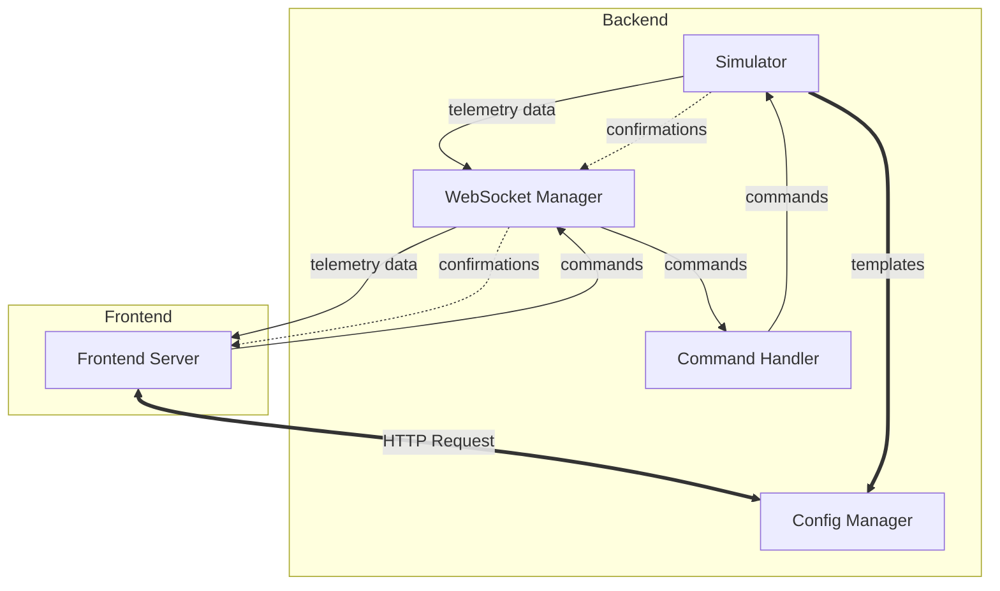

# Telemetry-App Backend

Python backend service providing real-time telemetry data streaming and command interface for the Telemetry-App project.

## Overview

This backend acts as a bridge between telemetry data sources (currently a simulator, designed for future real system integration) and the Angular frontend. It handles real-time data streaming, dynamic configuration management, and bidirectional command communication through WebSocket and HTTP endpoints.

## Architecture Principles

- **Modular Design**: Easy replacement of simulator with real telemetry systems
- **Unified Data Flow**: All data (telemetry + command confirmations + other notifications from the device) flows through WebSocket as individual messages
- **Configuration Separation**: Static templates served via HTTP, real-time data via WebSocket
- **Persistent Logging**: Historical data maintained in memory as a log, not a temporary buffer

## Technology Stack

- **Framework:** FastAPI (WebSocket + HTTP support)
- **Data Simulation:** Custom simulator module (hot-swappable)
- **Configuration:** JSON-based templates
- **Async Support:** asyncio for concurrent connections

## Project Structure

```
backend/
├── app.py                          # Main FastAPI application
├── requirements.txt                # Python dependencies
├── models/                         # Data models and schemas
│   ├── telemetry.py                # Telemetry data models
│   ├── configuration.py            # Configuration models
│   └── commands.py                 # Command models
├── services/                       # Business logic services
│   ├── simulator.py                # Telemetry data simulator
│   ├── websocket_manager.py        # WebSocket connection management
│   ├── configuration_manager.py    # Dynamic configuration management
│   └── command_handler.py          # Command processing and forwarding
├── utils/                          # Utility functions
│   ├── data_generator.py           # Data generation utilities
│   └── validators.py               # Data validation utilities
├── config/                         # Configuration files
│   ├── telemetry_types.json        # Default telemetry type definitions
│   └── command_templates.json      # Default command templates
├── tests/                          # Test suite
│   ├── test_websocket.py
│   ├── test_simulator.py
│   └── test_configuration.py
└── README.md                       # This file
```

## Core Components & Data Flow

1. **Simulator Service** - Generates mock telemetry data and handles command execution
2. **WebSocket Manager** - Manages client connections and real-time message broadcasting
3. **Configuration Manager** - Serves telemetry types and command templates
4. **Command Handler** - Processes and forwards commands to simulator/device

**Message Flow:**



## API Design

### WebSocket (`/ws`)

- **Purpose**: Real-time bidirectional communication
- **Outbound**: Individual telemetry messages `{type: "data", id: "sensor_name", value: Any, timestamp: ISO}`
- **Inbound**: Command messages `{type: "command", command: "command_name", parameters: {}}`

### HTTP Endpoints

- `GET /health` - Service status
- `GET /telemetry-types` - Available telemetry type definitions
- `GET /command-templates` - Available command schemas
- `GET /historical-data` - Query historical telemetry log

## Design Decisions

### Message Format Choice

**Individual messages per telemetry point** rather than bulk objects:

- Better granularity and real-time feel
- Easier frontend processing and buffering
- Efficient bandwidth usage
- Unified handling of telemetry data and command confirmations

### Command Confirmation Flow

**Commands confirmed through telemetry stream** rather than direct responses:

- Unified message handling on frontend
- Real-time feedback in telemetry feed
- Device-driven confirmation timing
- Consistent with real system behavior

### Configuration Architecture

**HTTP for templates, WebSocket for data**:

- Static configuration doesn't need real-time updates
- Reduces WebSocket message overhead
- Clear separation of concerns
- Standard REST patterns for configuration

### Historical Data as Log

**Persistent in-memory log** rather than rolling buffer:

- Complete audit trail of all telemetry
- Data survives across sessions
- Manual clearing only when needed
- Supports historical analysis and debugging

## Future Integration

The simulator is designed for easy replacement with real telemetry systems:

1. **Interface Compatibility**: Replace `simulator.py` while maintaining the same API
2. **Configuration Source**: Update template loading to read from real system schemas
3. **Command Interface**: Modify command handler to communicate with actual devices
4. **Data Format**: Ensure real system outputs match the established message format

Real systems should provide:

- Telemetry data in the established format
- Configuration templates defining available data types on connection
- Command schemas and confirmation mechanisms on connection

## Development Environment

**Setup**: Standard Python virtual environment with FastAPI
**Configuration**: Environment variables for intervals, connection limits, log sizes
**Testing**: pytest for unit tests, WebSocket test utilities included

## Notes and Reflections

*This section will be updated throughout the development process with insights, challenges, and solutions discovered during implementation.*

---

*This backend prioritizes simplicity, modularity, and clear data flow to support both development with simulated data and future integration with real telemetry systems.*
