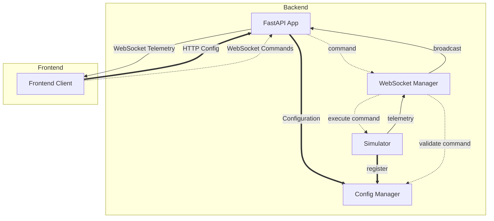

# Telemetry-App Backend

Python backend service providing real-time telemetry data streaming and command interface for the Telemetry-App project.

## Overview

This backend acts as a bridge between telemetry data sources (currently a simulator, designed for future real system integration) and the Angular frontend. It handles real-time data streaming, dynamic configuration management, and bidirectional command communication through WebSocket and HTTP endpoints.

## Architecture Principles

- **Modular Design**: Easy replacement of simulator with real telemetry systems
- **Unified Data Flow**: All data (telemetry + command confirmations + other notifications from the device) flows through WebSocket as individual messages
- **Dynamic Configuration**: Device-driven configuration templates served via HTTP, real-time data via WebSocket
- **Persistent Logging**: Historical data maintained in memory as a log, not a temporary buffer

## Technology Stack

- **Framework:** FastAPI (WebSocket + HTTP support)
- **Data Simulation:** Custom simulator module (hot-swappable)
- **Configuration:** Dynamic device-driven configuration
- **Async Support:** asyncio for concurrent connections

## Project Structure

```
backend/
├── app.py                          # Main FastAPI application
├── requirements.txt                # Python dependencies
├── models/                         # Data models and schemas
│   ├── telemetry.py                # Telemetry data models
│   ├── configuration.py            # Configuration models
│   └── commands.py                 # Command models
├── services/                       # Business logic services
│   ├── simulator.py                # Telemetry data simulator
│   ├── websocket_manager.py        # WebSocket connection management
│   └── configuration_manager.py    # Dynamic configuration management & validation
├── tests/                          # Test suite
│   ├── test_websocket.py
│   ├── test_simulator.py
│   └── test_configuration.py
└── README.md                       # This file
```

## Core Components & Data Flow

1. **FastAPI App** - Handles endpoints, both webSockets and HTTPS for
2. **Simulator Service** - Generates mock telemetry data and handles command execution
3. **WebSocket Manager** - Manages client connections and real-time message broadcasting (both incoming commands and outgoing telemetry data)
4. **Configuration Manager** - Provides dynamic device-driven configuration and validation services

**Message Flow:**



## API Design

### WebSocket (`/ws`)

- **Purpose**: Real-time bidirectional communication
- **Outbound**: Individual telemetry messages `{type: "data", id: "sensor_name", value: Any, timestamp: ISO}`
- **Inbound**: Command messages `{type: "command", command: "command_name", parameters: {}}`

### HTTP Endpoints

- `GET /health` - Service status
- `GET /telemetry-types` - Available telemetry type definitions
- `GET /command-templates` - Available command schemas
- `GET /command-validation/{command_id}` - Validation info for specific command
- `GET /config-summary` - Configuration summary and device status
- `GET /historical-data` - Query historical telemetry log

## Design Decisions

### Message Format Choice

**Individual messages per telemetry point** rather than bulk objects:

- Better granularity and real-time feel
- Easier frontend processing and buffering
- Efficient bandwidth usage
- Unified handling of telemetry data and command confirmations

### Command Confirmation Flow

**Commands confirmed through telemetry stream** rather than direct responses:

- Unified message handling on frontend
- Real-time feedback in telemetry feed
- Device-driven confirmation timing
- Consistent with real system behavior

### Configuration Architecture

**Dynamic device-driven configuration**:

- Devices/simulators register their capabilities on startup
- Configuration templates generated dynamically from device capabilities
- No static JSON configuration files needed
- Real-time validation against device-specific schemas
- Support for future translator/adapter patterns between different device types

### Historical Data as Log

**Persistent in-memory log** rather than rolling buffer:

- Complete audit trail of all telemetry
- Data survives across sessions
- Manual clearing only when needed
- Supports historical analysis and debugging

## Future Integration

The simulator is designed for easy replacement with real telemetry systems:

1. **Interface Compatibility**: Replace `simulator.py` while maintaining the same API
2. **Dynamic Registration**: Real devices register their capabilities on connection
3. **Command Interface**: Commands validated and forwarded through the same WebSocket flow
4. **Adapter Pattern**: Configuration manager can host translators between different device protocols
5. **Data Format**: Ensure real system outputs match the established message format

Real systems should provide:

- Capability registration defining available telemetry types and commands
- Telemetry data in the established format
- Command handling with appropriate confirmations
- Device-specific validation schemas

## Development Environment

**Setup**: Standard Python virtual environment with FastAPI
**Configuration**: Environment variables for intervals, connection limits, log sizes
**Testing**: pytest for unit tests, WebSocket test utilities included

## Notes and Reflections

**July 31, 2025 - Dynamic configuration & Architecture simplifications**
Decided to use dynamic configuration schemas, provided by the device on connection, for better compatibility with different devices in the future. This provides greater flexibility than the static files approach, and provides a way of changing specifications without needing to touch the webapp.
Also eliminated some planned scripts and services that became unnecessary, either because the specifications changed, or because their purpose was absorbed by other parts of the backend:

- Removed `command_handler.py` - commands now validated and forwarded directly by the server
- Removed `utils/` directory - validation integrated into Configuration Manager, data generation handled by Simulator
- Removed `config/` directory - dynamic configuration eliminates need for static JSON files

**August 04, 2025 - Fatal Error!!**
There's a fatal error in the handling of commands. There's no distinction between command templates and actual commands! This makes the backend unable to receive actual commands. Should fix ASAP.

*This section will be updated throughout the development process with insights, challenges, and solutions discovered during implementation.*

---

*This backend prioritizes simplicity, modularity, and clear data flow to support both development with simulated data and future integration with real telemetry systems.*
