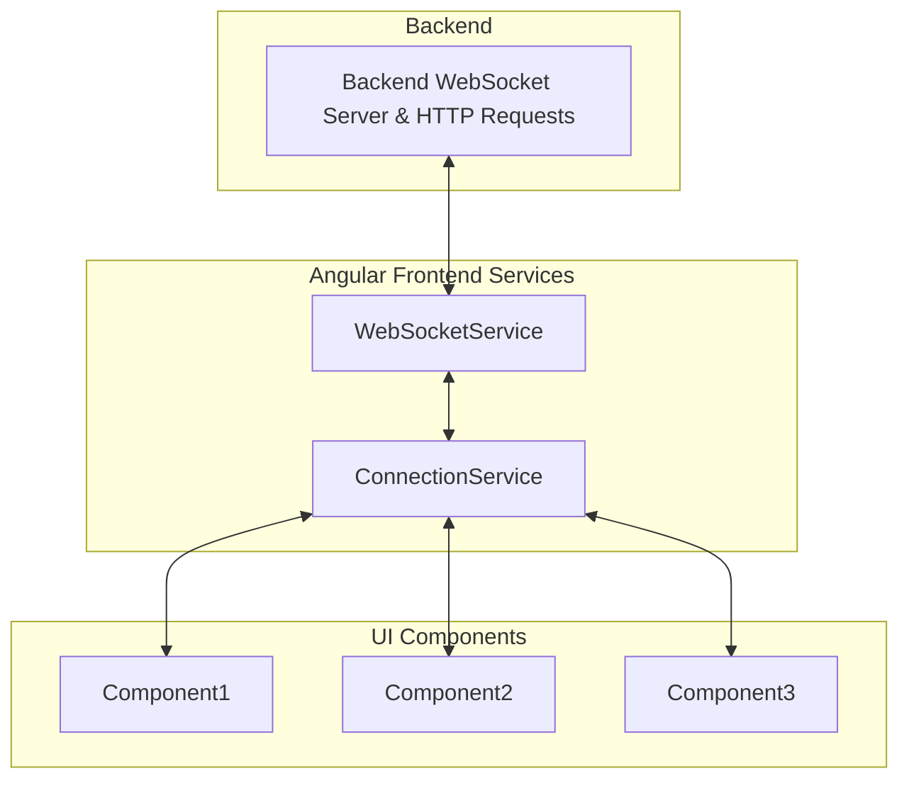

# Telemetry-App Frontend

Angular frontend application for real-time telemetry data visualization and monitoring.

## Overview

This is the frontend component of the Telemetry-App project, built with Angular 20.1.0+ and designed to display real-time telemetry data through interactive charts and dashboards. The application connects to a Python backend via WebSocket for live data streaming.

## Technology Stack

- **Framework:** Angular 20.1.0+
- **Language:** TypeScript 5.8.2+
- **Styling:** SCSS + Angular Material
- **Charts:** Chart.js with ng2-charts
- **HTTP Client:** Angular HttpClient
- **WebSockets:** Native WebSocket API with RxJS
- **Testing:** Jasmine + Karma
- **Build Tool:** Angular CLI

## Project Structure

```
src/
├── app/
│   ├── components/                     # Reusable UI components
│   │   ├── chart/                      # Chart components
│   │   ├── dashboard/                  # Dashboard layout
│   │   ├── header/                     # App header
│   │   └── sidebar/                    # Navigation sidebar
│   ├── services/                       # Angular services
│   │   ├── websocket.service.ts        # WebSocket communication, decoupled from the business logic
│   │   └── connection.service.ts       # Interface for all connection-related matters, implements the business logic
│   ├── models/                         # TypeScript interfaces
│   │   ├── telemetry.interface.ts      # Data models
│   │   ├── configuration.interface.ts  # Dynamic configuration models
│   │   ├── connection.interface.ts     # Models for connection related matters
│   │   └── chart-config.interface.ts   # Configuration interface for charts
│   ├── pages/                          # Route components
│   │   ├── dashboard/                  # Main dashboard page
│   │   ├── historical/                 # Historical data view
│   │   └── settings/                   # App settings
│   ├── shared/                         # Shared modules
│   │   ├── modules/                    # Feature modules
│   │   ├── pipes/                      # Custom pipes
│   │   └── directives/                 # Custom directives
│   ├── environments/                   # Environment configurations
│   │   ├── environment.ts              # Development configuration
│   │   └── environment.prod.ts         # Production configuration
│   └── assets/                         # Static assets
├── styles/                             # Global styles
│   ├── _variables.scss                 # SCSS variables
│   ├── _mixins.scss                    # SCSS mixins
│   └── themes/                         # Theme definitions
└── index.html                          # Main HTML file
```

## Features

#### Core Features

- [ ] Real-time telemetry dashboard
- [X] Dynamic telemetry type configuration from backend
- [ ] Multiple data visualization charts (line, bar, gauge)
- [X] WebSocket connection for live data updates
- [ ] Responsive design for different screen sizes
- [X] Data filtering and time range selection
- [X] Communication between backend and frontend

#### Advanced Features (If time permits)

- [ ] Historical data playback
- [ ] Alert/threshold configuration
- [ ] Data export functionality
- [ ] Windows / Grid dashboard view
- [ ] Multiple dashboard layouts
- [ ] Dark/light theme toggle
- [ ] Custom chart configurations
- [ ] Mobile support
- [X] Dynamic command interface based on backend configuration
- [X] Real-time validation of telemetry data based on received schemas
- [X] Data buffering

## Components Architecture

### Core Components

- **DashboardComponent** - Main dashboard container and layout
- **ChartComponent** - Reusable and configurable chart component for different chart types
- **ConsoleComponent** - Reusable and configurable console
- **DynamicButtonComponent** - Dynamically generated button components based on command configuration from backend
- **ConfigurationComponent** - Displays and manages the dynamic telemetry and command configurations
- **HeaderComponent** - Application header with navigation and controls
- **SidebarComponent** - Navigation sidebar for different views

### Services

### Services

- **WebSocketService** - Pure transport layer for WebSocket communication
    - Connection management with auto-reconnection
    - Raw message passing without business logic
    - Proper error handling and timeout management

- **ConnectionService** - Complete business logic layer
    - Message parsing, validation, and type filtering
    - In-memory buffering with configurable size limits
    - HTTP configuration fetching (telemetry types, command templates)
    - Command validation with parameter checking
    - Centralized error management
- **ConnectionService** - An interface for all connection-related inquiries by other components

## Data Models

Key TypeScript interfaces and models are defined in the `/src/app/models/` directory:

- **TelemetryMessage** - Core telemetry data structure
- **TelemetryConfiguration** - Dynamic configuration received from backend defining available telemetry types, formats, and validation rules
- **CommandConfiguration** - Dynamic configuration defining available commands that can be sent to the backend
- **ChartConfig** - Chart configuration including type, data source, and display options
- **DataFormat** - Enum for supported data formats (int, float, string, boolean, array, object)

## Connection Architecture

- **WebSocketService** establishes and handles connection to the backend
- **ConnectionService** subscribes to WebSocketService, validates data and stores a buffer of messages; offering a interface for the rest of components. Sends and validates commands via websockets to the backend
- **Components** request or send data and commands, and subscribe to new data to the ConnectionService. They don't interact with the WebSocketService directly



## Styling Guidelines

- SCSS with Angular Material design system
- Component-scoped styling with global theme variables
- Responsive design using CSS Grid and Flexbox
- Light/dark theme support via CSS custom properties
- Material Design color palette and typography scale

## Development Setup

### Prerequisites

- Node.js 18+ and npm
- Angular CLI (`npm install -g @angular/cli`)

### Installation

```bash
# Install dependencies
npm install

# Start development server
ng serve

# Run with specific port
ng serve --port 4200

# Run with proxy configuration
ng serve --proxy-config proxy.conf.json
```

### Development URLs

- Application: `http://localhost:4200`
- Backend API: `http://localhost:8000`
- WebSocket: `ws://localhost:8000/ws`

## Configuration

### Environment Configuration

Environment-specific settings are in `/src/environments/`:

- API endpoints and WebSocket URLs
- Refresh rates and data limits
- Chart configuration
- Logging configuration

### Proxy Configuration

Proxy setup for local development to connect with backend API and WebSocket endpoints.

## Testing

### Unit Tests

```bash
ng test                    # Run unit tests
ng test --code-coverage    # Run with coverage report
```

### E2E Tests

```bash
ng e2e                     # Run end-to-end tests
```

## Build and Deployment

### Development Build

```bash
ng build
```

### Production Build

```bash
ng build --configuration production
```

### Build Optimization

- Tree shaking enabled
- Lazy loading for feature modules
- OnPush change detection strategy
- Trackby functions for ngFor loops

## Performance Considerations

- OnPush change detection strategy for optimal performance
- Data point limiting to prevent memory issues with large datasets
- Lazy loading for feature modules
- Efficient WebSocket data processing outside Angular zones
- Chart.js optimization for real-time updates

## Error Handling

- WebSocket reconnection logic for connection failures
- HTTP error interceptors with user-friendly error messages
- Graceful degradation when backend is unavailable
- Loading states and error boundaries for better UX

## Design Decisions

### Connection

Connection managamente sepparated in two services:

- **WebSocketService**: Uncoupled from all the business logic, only handles the websocket connexion
- **ConnectionService:** Handles all the business logic: subscribes to WebSocketService, makes http calls and provides data validation and buffering. Also provides a handy interface for the rest of components

This provides a clear separation between the connection to the webSocket and the business logic. It could be separated into more services, like a httpClient service, a buffering service, etc. But that would most likely be over-engineered for something this small. Separate services should only be created when the need arises, or the complexity and responsibilities of one service grow too large.

## Notes and Reflections

**August 01, 2025 - Models and Websocket Service**
Set up the models for telemetry and configuration, basically a copy of the backend models, and the models for everything needed in the connection managing.
Implemented the websocket service. It has a decoupled logic to make it completely modular and easy to debug. Business logic will be handled by the Connection service.

**August 02, 2025 - Connection Service**
Set up the Connection Service, wich provides an interface for the rest of components. Data buffering, data and command validation, as well as http requests have all been implemented in this service. That is, the Connection Service holds all the business logic.
This way, separation of concerns is enforced, and a clear interface with everything needed is provided via this service.

## Resources

- [Angular Documentation](https://angular.io/docs)
- [Angular Material](https://material.angular.io/)
- [Chart.js Documentation](https://www.chartjs.org/docs/)
- [RxJS Documentation](https://rxjs.dev/)
- [TypeScript Handbook](https://www.typescriptlang.org/docs/)
