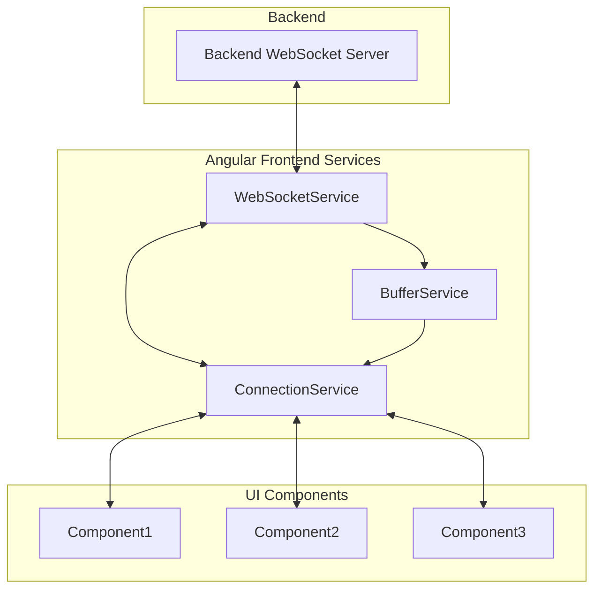

# Telemetry-App Frontend

Angular frontend application for real-time telemetry data visualization and monitoring.

## Overview

This is the frontend component of the Telemetry-App project, built with Angular 20.1.0+ and designed to display real-time telemetry data through interactive charts and dashboards. The application connects to a Python backend via WebSocket for live data streaming.

## Technology Stack

- **Framework:** Angular 20.1.0+
- **Language:** TypeScript 5.8.2+
- **Styling:** SCSS + Angular Material
- **Charts:** Chart.js with ng2-charts
- **HTTP Client:** Angular HttpClient
- **WebSockets:** Native WebSocket API with RxJS
- **Testing:** Jasmine + Karma
- **Build Tool:** Angular CLI

## Project Structure

```
src/
├── app/
│   ├── components/                     # Reusable UI components
│   │   ├── chart/                      # Chart components
│   │   ├── dashboard/                  # Dashboard layout
│   │   ├── header/                     # App header
│   │   └── sidebar/                    # Navigation sidebar
│   ├── services/                       # Angular services
│   │   ├── websocket.service.ts        # WebSocket communication
│   │   ├── buffer.service.ts           # Data buffer
│   │   ├── connection.service.ts       # Interface for all connection-related matter
│   │   ├── configuration.service.ts    # Dynamic telemetry and command configurations
│   │   └── command.service.ts          # Sending dynamic commands to backend
│   ├── models/                         # TypeScript interfaces
│   │   ├── telemetry.interface.ts      # Data models
│   │   ├── configuration.interface.ts  # Dynamic configuration models
│   │   └── chart-config.interface.ts
│   ├── pages/                          # Route components
│   │   ├── dashboard/                  # Main dashboard page
│   │   ├── historical/                 # Historical data view
│   │   └── settings/                   # App settings
│   ├── shared/                         # Shared modules
│   │   ├── modules/                    # Feature modules
│   │   ├── pipes/                      # Custom pipes
│   │   └── directives/                 # Custom directives
│   ├── environments/                   # Environment configurations
│   │   ├── environment.ts              # Development configuration
│   │   └── environment.prod.ts         # Production configuration
│   └── assets/                         # Static assets
├── styles/                             # Global styles
│   ├── _variables.scss                 # SCSS variables
│   ├── _mixins.scss                    # SCSS mixins
│   └── themes/                         # Theme definitions
└── index.html                          # Main HTML file
```

## Features

#### Core Features

- [ ] Real-time telemetry dashboard
- [ ] Dynamic telemetry type configuration from backend
- [ ] Multiple data visualization charts (line, bar, gauge)
- [ ] WebSocket connection for live data updates
- [ ] Responsive design for different screen sizes
- [ ] Data filtering and time range selection
- [ ] Communication between backend and frontend

#### Advanced Features (If time permits)

- [ ] Historical data playback
- [ ] Alert/threshold configuration
- [ ] Data export functionality
- [ ] Windows / Grid dashboard view
- [ ] Multiple dashboard layouts
- [ ] Dark/light theme toggle
- [ ] Custom chart configurations
- [ ] Mobile support
- [ ] Dynamic command interface based on backend configuration
- [ ] Real-time validation of telemetry data based on received schemas

## Components Architecture

### Core Components

- **DashboardComponent** - Main dashboard container and layout
- **ChartComponent** - Reusable and configurable chart component for different chart types
- **ConsoleComponent** - Reusable and configurable console
- **DynamicButtonComponent** - Dynamically generated button components based on command configuration from backend
- **ConfigurationComponent** - Displays and manages the dynamic telemetry and command configurations
- **HeaderComponent** - Application header with navigation and controls
- **SidebarComponent** - Navigation sidebar for different views

### Services

- **WebSocketService** - Handles WebSocket connection and real-time data streaming
- **BufferService** - Acts as a buffer for data, to avoid unnecessary calls to the backend, and have faster response (no downtime waiting, most times at least)
- **ConnectionService** - An interface for all connection-related inquiries by other components
- **ConfigurationService** - Manages dynamic telemetry types and command configurations received from backend
- **CommandService** - Handles sending dynamic commands to the backend based on received command configuration

## Data Models

Key TypeScript interfaces and models are defined in the `/src/app/models/` directory:

- **TelemetryData** - Core telemetry data structure with timestamp, value, type, and metadata
- **TelemetryConfiguration** - Dynamic configuration received from backend defining available telemetry types, formats, and validation rules
- **CommandConfiguration** - Dynamic configuration defining available commands that can be sent to the backend
- **ChartConfig** - Chart configuration including type, data source, and display options
- **DataFormat** - Enum for supported data formats (int, float, string, boolean, array, object)

## Connection Architecture

- **WebSocketService** establishes and handles connection to the backend
- **BufferService** subscribes to WebSocketService and keeps arrays of data (with some size limit)
- **ConnectionService** subscribes to WebSocketService and gets data either from the buffer or websockets. Sends commands and data via websockets to the backend
- **Components** request or send data and commands, and subscribe to new data to the ConnectionService. They don't interact with the other two services involved



## Styling Guidelines

- SCSS with Angular Material design system
- Component-scoped styling with global theme variables
- Responsive design using CSS Grid and Flexbox
- Light/dark theme support via CSS custom properties
- Material Design color palette and typography scale

## Development Setup

### Prerequisites

- Node.js 18+ and npm
- Angular CLI (`npm install -g @angular/cli`)

### Installation

```bash
# Install dependencies
npm install

# Start development server
ng serve

# Run with specific port
ng serve --port 4200

# Run with proxy configuration
ng serve --proxy-config proxy.conf.json
```

### Development URLs

- Application: `http://localhost:4200`
- Backend API: `http://localhost:8000`
- WebSocket: `ws://localhost:8000/ws`

## Configuration

### Environment Configuration

Environment-specific settings are in `/src/environments/`:

- API endpoints and WebSocket URLs
- Refresh rates and data limits
- Feature flags for development vs production

### Proxy Configuration

Proxy setup for local development to connect with backend API and WebSocket endpoints.

## Testing

### Unit Tests

```bash
ng test                    # Run unit tests
ng test --code-coverage    # Run with coverage report
```

### E2E Tests

```bash
ng e2e                     # Run end-to-end tests
```

## Build and Deployment

### Development Build

```bash
ng build
```

### Production Build

```bash
ng build --configuration production
```

### Build Optimization

- Tree shaking enabled
- Lazy loading for feature modules
- OnPush change detection strategy
- Trackby functions for ngFor loops

## Performance Considerations

- OnPush change detection strategy for optimal performance
- Data point limiting to prevent memory issues with large datasets
- Lazy loading for feature modules
- Efficient WebSocket data processing outside Angular zones
- Chart.js optimization for real-time updates

## Error Handling

- WebSocket reconnection logic for connection failures
- HTTP error interceptors with user-friendly error messages
- Graceful degradation when backend is unavailable
- Loading states and error boundaries for better UX

## Design Decisions

*Will host sections explaining all the decisions made in the process and why were they made*

## Notes and Reflections

*This section will be updated throughout the development process with insights, challenges, and solutions discovered during implementation.*

## Resources

- [Angular Documentation](https://angular.io/docs)
- [Angular Material](https://material.angular.io/)
- [Chart.js Documentation](https://www.chartjs.org/docs/)
- [RxJS Documentation](https://rxjs.dev/)
- [TypeScript Handbook](https://www.typescriptlang.org/docs/)
